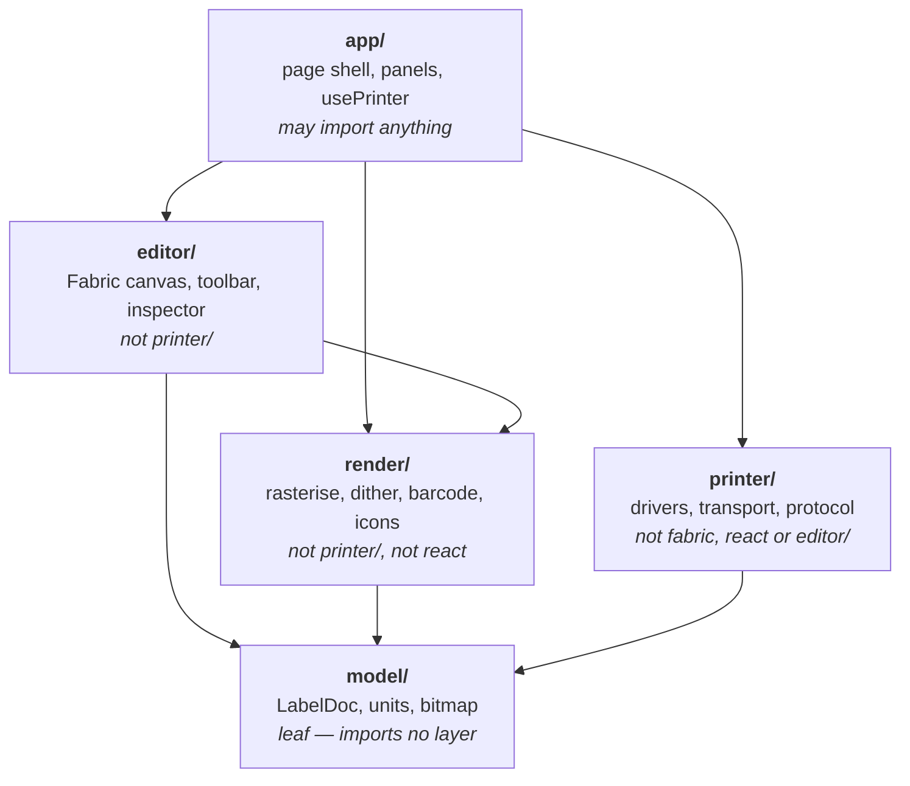

# LabelForge

A browser-based label designer and printer driver for **MarkLife P50 / P50S** thermal
label printers, built to replace the vendor's phone app.

| Model              | Status                                                                |
| ------------------ | --------------------------------------------------------------------- |
| **P50 / P50S**     | Confirmed — developed and tested against real hardware                |
| **M60 / X2**       | Unverified — believed to use the same protocol, never run against one |
| **P15 / P12 / P7** | Recognised and declined — they use a different, uncompressed protocol |

The last row is deliberate: those printers are identified by name and refused with a
reason, rather than being connected to and sent commands they cannot parse. See
`docs/PROTOCOL.md` for the evidence behind each row.

No install, no server, no account: a static site that talks to the printer directly
over **Web Bluetooth**.

## Status

**Working end to end on a real P50S.** Text, shapes, barcodes, QR, images and symbols
design in the browser and print over Bluetooth, and successive labels stay registered
on gap stock without manual calibration.

That last part took some getting to. The vendor SDK contains no gap-seek command, and
four rounds of reasoning from the SDK plus hardware testing concluded — wrongly — that
none existed. Capturing the vendor Android app's own Bluetooth traffic settled it in
one pass: the seek is `1F 12 20 00`, a command that had been in our table the whole
time, issued _after_ the raster payload and before the job ends. Sent anywhere else it
does nothing at all, which is why it had been written off.

The same capture corrected three other guesses: the raster is sent at label width with
no padding to the head, paper type uses a different mode byte, and print parameters go
out in a longer form than the SDK documents. `scripts/parse-btsnoop.mjs` decodes such a
capture against the known command set, and `docs/PROTOCOL.md` records both the findings
and the reasoning that failed.

Tall labels needed one more thing. The printer honours that seek only in a job it has
read in full, and it starts printing once its ~18 KB buffer fills — so on an 80 mm
photo label the seek is still unread when the label comes out, and the roll stops
mid-label. The vendor app has the same problem and does nothing about it.

The size is the whole constraint, and the dither is what decides it: error diffusion
scatters a photograph into nearly random dots that will not compress. Softening the
diffusion or switching to an ordered grid takes the same 384 × 640 raster from about
23 KB to 15 or to 6. So when a label is too big, the print panel rasterises the
alternatives, offers the mildest one that actually fits with the real figures, and
applies it on a click — and under the line the label is simply an ordinary job that
registers itself. For pictures too detailed for any of that, an oversized job can be
followed by a small one carrying nothing but the seek, though on this firmware that
behaves as a form feed and costs a blank label.

Working today:

- Web Bluetooth connection, with identity and status queries, credit-based flow
  control, chunked transfer, progress and cancellation
- The vendor app's exact print sequence, including the sensor gap seek, so labels
  self-register — at any label height, which the vendor app itself manages only on
  short stock
- Label documents in millimetres, with stock presets and gap/continuous paper
- Text, rectangles, ellipses and lines
- Three bundled typefaces chosen for 203 dpi — Fira Sans, Archivo Narrow and
  JetBrains Mono, all OFL 1.1 — so a label prints the same on every machine,
  plus your own font files if you have them. The old `sans-serif`/`serif`/`monospace`
  options are still there but labelled for what they are: whatever the machine
  happens to have, which is not the same font on Windows, Linux and Android
- Barcodes (Code 128/39, EAN-8/13, ITF-14, GS1-128, Data Matrix) and QR codes,
  rendered at whole-dot module widths with proper quiet zones
- Image upload with a line-art/photo choice that decides between hard thresholding
  and dithering, plus per-image threshold, dither algorithm (Floyd–Steinberg,
  Atkinson or ordered Bayer), diffusion strength, brightness, contrast and inversion
  — see `docs/RENDERING.md` for which to reach for when a photo prints muddy
- A 70-symbol library drawn for thermal output, grouped and including the full
  copyright/copyleft/Creative Commons family
- Templates, plus self-contained JSON export/import with images inlined
- A live preview of the exact bitmap the hardware would receive, including a
  thermal-bleed simulation that reveals text which will smear shut before you waste
  a label
- A **virtual printer** that runs the real command sequence and the real encoder
  against no hardware at all. Bluetooth is the default output; tick _Offer the
  virtual printer_ under Diagnostics to get it back as a choice

Settings that exist only for diagnosis — head padding and alignment, manual gap feed,
the commands this firmware ignores — are folded into **Advanced** sections, since the
defaults now match what the vendor app does. Two go further and are hidden outright
until asked for in **Diagnostics**: the virtual printer, and the speed selector and
test patterns in the Print panel. Neither is a preference — both are admissions that
a control exists for diagnosing this app rather than for printing a label, and the
speed command in particular is one the vendor app never sends at all.

## Requirements

- **Chrome or Edge on Windows/macOS/ChromeOS**, or **Chrome on Android**.
  Safari and Firefox do not implement Web Bluetooth and cannot work.
- HTTPS or `localhost`. GitHub Pages satisfies this.

## Development

```bash
npm install
npm run dev
```

```bash
npm test
```

Tests run in two tiers. Pure logic — geometry, 1-bit packing, compression, the
protocol encoder — runs in Node. Anything touching a canvas runs in real Chromium
via Playwright, because rasterising text or barcodes in jsdom would exercise a
different renderer than the one that ships.

The strongest test in the suite renders each barcode exactly as it would be sent to
the head, then decodes it back with zxing and jsQR. That is the only way to catch a
code that looks right on screen and will not scan on paper.

```bash
npx playwright install chromium   # once, for the browser tier
```

## Documentation

- `docs/PROTOCOL.md` — the wire protocol: GATT profile, command set, raster format,
  the captured print sequence — with a sequence diagram — and how to capture one
  yourself
- `docs/RENDERING.md` — how a document becomes dots: the two-plane rasteriser, the
  dithering controls with guidance on choosing between them, and how text is loaded
  and rendered
- `docs/THIRD_PARTY.md` — dependencies, provenance and licensing

### Layout

Five layers, with the dependency rules enforced in CI by
`scripts/check-layering.mjs`. The point is that hardware concerns stay quarantined in
`printer/`, so the editor and renderer stay testable with no Bluetooth in sight.



```bash
npm run snoop captures/btsnoop_hci.log
```

Decodes an Android Bluetooth HCI snoop log down to the printer's command stream, with
every byte matched against the known command table. Needs no Wireshark.

## Licence

MIT — see `LICENSE`. This project contains no vendor SDK code; see
`docs/THIRD_PARTY.md`.
