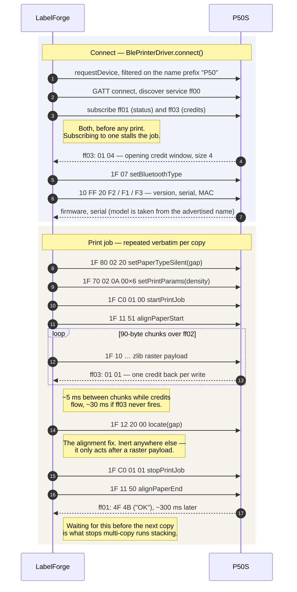

# MarkLife P50 / P50S wire protocol

How this document was arrived at, and how much to trust each part of it. See
`docs/THIRD_PARTY.md` for provenance.

There are four tiers of evidence here, and the difference between them turned out to
matter enormously:

1. **Read from the vendor SDK.** A starting point, no more. The published SDK is a
   tidied-up facade over an archived original, and where they disagree the facade is
   frequently wrong — it invents commands that appear nowhere in the vendor's own code
   and that no real printer answers. Marked **[unconfirmed]** where untested.
2. **Tested against a real P50S** (firmware V2.0.00). Reliable about what was tested,
   but read the _exact_ claim: "does nothing" always means "does nothing in the
   position it was sent in", which is not the same as unimplemented. That distinction
   is what hid the gap-seek command for four rounds of investigation.
3. **Captured from the vendor Android app** over Bluetooth HCI snoop, then replayed
   and confirmed on hardware. This is ground truth and it overrides both of the above.
   `scripts/parse-btsnoop.mjs` decodes such a capture; the procedure is at the end of
   this document.
4. **Third-party reverse engineering, unconfirmed here.** Facts published by someone
   else that have never been seen on our own wire. Weaker than tier 1, not stronger:
   an SDK at least ships with the product, whereas this is a stranger's reading of a
   decompile we have not repeated. Useful for knowing what to look for and for
   corroborating something already confirmed; never sufficient on its own. Marked
   **[tier 4]** at the point of use, and where it contradicts tiers 2 or 3 the
   confirmed evidence wins and the disagreement is recorded rather than resolved.

**Where a section carries a tier-3 finding it says so.** Several tier-1 and tier-2
conclusions in here were flatly wrong, and rather than quietly deleting them the
reasoning that failed is kept alongside the correction — the failure modes repeat, and
a plausible inference that fit the evidence is exactly the thing to be wary of next
time.

## Transport

Bluetooth **Low Energy** (GATT). Not Bluetooth Classic / SPP — the device never
appears as a pairable device in the OS Bluetooth settings, which is why the vendor
manual tells users not to pair from system settings.

| Role                          | UUID                                   |
| ----------------------------- | -------------------------------------- |
| Primary service               | `0000ff00-0000-1000-8000-00805f9b34fb` |
| Notify — printer status       | `0000ff01-0000-1000-8000-00805f9b34fb` |
| Write — host to printer       | `0000ff02-0000-1000-8000-00805f9b34fb` |
| Notify — flow-control credits | `0000ff03-0000-1000-8000-00805f9b34fb` |

Discovery: filter on the advertised **name prefix** (`P50`), _not_ on the service
UUID. These printers do not advertise the 128-bit service UUID, so a service filter
returns an empty device chooser. Advertised names look like `P50_2950_BLE`.

Writes go to `ff02` in chunks of ~90 bytes.

**Flow control — confirmed on a P50S (firmware V2.0.00).** `ff03` frames are
`[type, ...]` and **only type `0x01` carries credits**. The opening frame is
`01 04`, which sets the window to 4; subsequent `01 01` frames each add one, and
one arrives per write. A frame of `02 dc 00` was also observed on this channel
and is _not_ a credit grant — its meaning is unknown. Reading byte 1 regardless
of the type, as the vendor SDK does, turns that into a phantom grant of 220 and
silently disables flow control for the rest of the session.

Use ~5 ms between chunks while credits are flowing, falling back to ~30 ms if
`ff03` never fires.

Subscribe to **both** `ff01` and `ff03` before starting a print, or the job stalls.

## Commands

All multi-byte values are big-endian.

### Print control

| Purpose                             | Bytes                            |
| ----------------------------------- | -------------------------------- |
| Start print job                     | `1F C0 01 00`                    |
| Stop print job                      | `1F C0 01 01`                    |
| Set BT type (send after connecting) | `1F B2 00`                       |
| Align paper to start                | `1F 11 51`                       |
| Align paper to end (feed out)       | `1F 11 50`                       |
| Adjust position                     | `1F 11 <mode> <distHi> <distLo>` |
| Locate                              | `1F 12 <mode> 00`                |
| Locate (auto)                       | `0C`                             |

`adjustPosition` mode: `0x00` forward in dots, `0x01` forward in mm, `0x10` backward
in dots, `0x11` backward in mm.
`locate` mode: `0x10` none, `0x20` gap (die-cut labels), `0x30` black mark.

### Configuration

| Purpose                | Bytes                                                          |
| ---------------------- | -------------------------------------------------------------- |
| Set paper type         | `1F 80 01 <type>` — `10` continuous, `20` gap, `30` black mark |
| Get paper type         | `1F 80 00`                                                     |
| Set density (darkness) | `1F 70 01 <1..15>`                                             |
| Get density            | `1F 70 00`                                                     |
| Set speed              | `1F 60 01 <0 low \| 1 med \| 2 high>`                          |
| Get speed              | `1F 60 00`                                                     |

### Commands from the SDK's archived original — prefer these

The published SDK ships a tidied-up facade **and** the original it was derived
from, in `lib/archive/original_interface_chinese.js`. Where they disagree, trust
the original: several of the facade's commands appear nowhere in the vendor's own
code and are silent on real hardware.

| Purpose            | Original                      | Tidied facade           | Notes                                                           |
| ------------------ | ----------------------------- | ----------------------- | --------------------------------------------------------------- |
| Locate next label  | `1D 0C`                       | `0C` / `1F 12 <m> 00`   | ESC/POS `GS FF`. The gap-alignment primitive.                   |
| Feed n dot lines   | `1B 4A <n>`                   | _absent_                | ESC/POS `ESC J`. 8 lines = 1 mm.                                |
| Learn label gap    | `10 FF 03`                    | `1F 30 60`              |                                                                 |
| Label height       | `10 FF 50 F2`                 | _absent_                | Same family as battery, which answers.                          |
| Status (bit field) | `10 FF 40`                    | `1F 20 00`              | See below.                                                      |
| Printer info       | `10 FF 70`                    | _absent_                |                                                                 |
| Bluetooth name     | `10 FF 30 11`                 | used as _MAC_           |                                                                 |
| Bluetooth MAC      | `10 FF 30 12`                 | _absent_                |                                                                 |
| BT module version  | `10 FF 30 10`                 | _absent_                |                                                                 |
| Density            | `10 FF 10 00 <n>`             | `1F 70 01 <n>`          | Which the P50S honours is unknown.                              |
| Set BT type        | `1F B2 11`                    | `1F B2 00`              | The facade's value works in practice.                           |
| Job start / stop   | `10 FF FE 01` / `10 FF FE 45` | `1F C0 01 00` / `01 01` | **The facade's is correct here** — printing works with `1F C0`. |

**Status is a bit field, not an enum.** Zero means healthy; bit 0 printing,
bit 1 cover open, bit 2 out of paper, bit 3 low battery, bit 4 head overheating.

**Gap alignment procedure**, from the original's own comment on `getLabelHeight`:
issue `1D 0C` about three times, waiting for an `OK` after each, and only then
read `10 FF 50 F2`. Asking earlier returns an inaccurate height.

**`setPaperType` takes two arguments** in the original — `1F 80 <model> <type>`,
where model `0x01` makes the printer reply `OK`/`ER` and `0x02` is silent. The
facade hardcodes `0x01`, which is why an `OK` shows up during a print.

### Maintenance and status

**Several of these are inert on a P50S (firmware V2.0.00) when sent on their own.**
`1f 40` (self test), `1f 30 60` (learn paper) and `1f 11 50` (feed) produced no
observable effect — the printer accepts the write, grants a credit, and does
nothing. Wrapping them in an _empty_ `1f c0 01 00` … `1f c0 01 01` makes no
difference; that was tried and refuted.

**`1f 12 20 00` (locate gap) was on this list and does not belong here.** It is
inert in isolation and it is also the working sensor gap seek, once it follows a
raster payload inside a job. That is now the basis of label registration — see
"Keeping successive labels aligned". The lesson generalises: this list records
where a command was tested, not what the firmware implements.

They are kept in the command table because they come from the vendor SDK and may
be implemented on other models in the family, but nothing should depend on them.
**Printing does not need any of them.**

A caution about how this was nearly mis-concluded: `1f 11 50` seemed to "work
inside a print", but printing a raster advances the paper by itself, so the feed
could not be attributed to the command. Only commands whose effect is
distinguishable from the raster print should be treated as confirmed.

Confirmed working, by contrast: `1f c0` (job control), `1f 10` (raster) and the
`10 ff` information queries.

| Purpose                            | Bytes                                      |
| ---------------------------------- | ------------------------------------------ |
| Self test print                    | `1F 40`                                    |
| Learn paper (calibrate gap sensor) | `1F 30 60`                                 |
| Read sensor                        | `1F 30 <00 temp \| 01 voltage \| 02 opto>` |
| Printer status                     | `1F 20 00`                                 |
| Model                              | `10 FF 20 F0`                              |
| Firmware version                   | `10 FF 20 F1`                              |
| Serial number                      | `10 FF 20 F2`                              |
| Battery                            | `10 FF 50 F1`                              |
| Bluetooth MAC                      | `10 FF 30 11`                              |
| Set auto-shutdown minutes          | `10 FF 12 <hi> <lo>`                       |
| Get auto-shutdown                  | `10 FF 13`                                 |

Note the two prefixes are not two protocol generations: `1F` is used for print
control and configuration, `10 FF` for device-information queries. There is no
version negotiation anywhere in the command set.

### Dangerous — never expose in normal UI

| Purpose               | Bytes            |
| --------------------- | ---------------- |
| Reset to factory data | `1F 50 BE`       |
| Enter bootloader      | `1F A0 BE 66 88` |

Reachable only through the diagnostics raw-hex box.

## Raster image command

```
1F 10 <rowBytesHi> <rowBytesLo> <heightHi> <heightLo> <payloadLen BE32> <payload>
```

- `rowBytes = (widthDots + 7) >> 3`.
  **The width field carries bytes per row, not dots.** Community documentation
  describes this field as "width", which is misleading and will cost you a debugging
  session.
- `height` is in dots (rows).
- `payloadLen` is the length of the compressed payload, 32-bit big-endian.
- `payload` is `zlib.deflate(packed, { level: -1, windowBits: 10, memLevel: 8,
strategy: 0 })` — a standard zlib stream, _not_ raw deflate.

Bit packing: row-major, rows padded to a whole byte, **MSB first**, a set bit means a
**black** dot.

Source pixels (RGBA) are binarised as:

```
black  ⟺  (r + g + b) / 3 <= 200  AND  alpha != 0
```

Note this is a naive mean, not a luminance-weighted grayscale, and fully transparent
pixels are always white regardless of colour. We binarise upstream in the render
pipeline (with proper luminance weighting and, for photos, Floyd–Steinberg dithering)
and hand this stage pure black-or-white pixels, so its own threshold is a pass-through.

## Replies — confirmed on a P50S (firmware V2.0.00)

Replies arrive on `ff01` as unsolicited notifications; there is no request id, so
a query takes the next frame.

| Query                  | Reply                  | Decoded                      |
| ---------------------- | ---------------------- | ---------------------------- |
| firmware `10 FF 20 F1` | `56 32 2e 30 2e 30 30` | ASCII `V2.0.00`              |
| serial `10 FF 20 F2`   | `35 30 …  00`          | ASCII digits, NUL-terminated |
| battery `10 FF 50 F1`  | `00 64`                | `0x64` = 100 (percent)       |
| print complete         | `4f 4b`                | ASCII `OK`                   |

### What a P50S (V2.0.00) actually implements

Tested one at a time, each waiting out a 1.2 s timeout. Replies land ~330 ms
after the request.

| Query                                       | Result                                          |
| ------------------------------------------- | ----------------------------------------------- |
| `10 FF 20 F1` firmware                      | ✅ `V2.0.00`                                    |
| `10 FF 20 F2` serial                        | ✅ ASCII digits, NUL-terminated                 |
| `10 FF 50 F1` battery                       | ✅ `00 53` → 83 %                               |
| `10 FF 13` shutdown time                    | ✅ `0f` → 15 minutes                            |
| `10 FF 20 F0` model                         | ❌ silent                                       |
| `10 FF 40` status flags                     | ❌ silent                                       |
| `10 FF 50 F2` label height                  | ❌ silent                                       |
| `10 FF 70` printer info                     | ❌ silent                                       |
| `10 FF 30 10/11/12` BT version / name / MAC | ❌ silent                                       |
| `10 FF 03` learn label gap                  | ❌ silent                                       |
| every `1F` getter from the tidied facade    | ❌ silent — they do not exist in the vendor SDK |

So the archived original's byte sequences are transcribed correctly, but this
firmware implements only a subset. The model is taken from the advertised BLE
name instead; observed forms are `P50S-F871-BLE` and `P50_2950_BLE`, so split on
either separator.

### Paper motion: only printing moves paper

**Every dedicated motion command is inert when sent on its own.** `1D 0C` (locate
label), `1B 4A n` (ESC/POS feed dot lines), `1F 30 60` (learn paper), `1F 40`
(self test) and `1F 11 5x` bare are all acknowledged with a credit and then
ignored. The documented three-locates-then-read-height calibration cannot run: the
locates do nothing and the height query is unimplemented.

**Caveat, added later and important:** "on its own" is doing real work in that
sentence. `1F 12 20 00` behaves exactly like the commands above in isolation, and
it is nevertheless the working gap seek when it follows a raster inside a job. Do
not read the list as proof that these opcodes are unimplemented — only that they
are inert in the position they were tested in. See "Keeping successive labels
aligned" below.

What does move paper is a **print job**. So to feed a known distance, print an
all-white raster of that height: the head advances the rows and fires no dots.
Confirmed working on hardware; every alternative was confirmed not to.

### Keeping successive labels aligned — solved and confirmed

**A sensor gap seek does exist, it is `1F 12 20 00` — `locate` in gap mode — and with
it in the right place labels now register correctly print after print.**

This was reverse-engineered wrongly twice before an HCI capture of the vendor
Android app settled it, so the reasoning is worth recording:

- Sent standalone, `1F 12 20 00` does nothing. That is real, repeatable, and it is
  why the command was written off as inert.
- Sent inside an _empty_ print job it also does nothing. That refuted the
  "commands only work inside a job" theory.
- The capture shows the vendor app issuing it **after the raster payload and before
  `stopPrintjob`**. The theory was not wrong, it was too weak: what the command
  needs is a job with something in it.

So the earlier conclusion that "no closed-loop option exists" was wrong. It was
also wrongly _argued_ — the reasoning ran that because the vendor app misprints the
first label after a roll change and gets every later one right, it must be doing
open-loop post-print feeding, since a seek would have fixed the first too. That
sounded tidy and was false: the seek runs at the _end_ of each job, so it registers
the _next_ label. The first print after loading is misaligned precisely because no
job has ended yet.

The workaround built on that mistaken conclusion — appending blank rows to advance
a full label pitch — still works and is still available for continuous stock, but
it is no longer the mechanism.

### What the vendor app never sends

Worth knowing, because several of these were assumed:

- **No `setSpeed` (`1F 60`) at all.** Speed may be one of the six unidentified
  bytes in `1F 70 02`.
- **No feed command of any kind** — no `1B 4A`, no `1D 0C`.
- **No `learnLabelGap` (`10 FF 03`)** and no `getLabelHeight`.
- **No `setPaperType` mode `01`.** It uses mode `02` exclusively.
- **No padding of the raster to head width.** See Geometry.

## Print sequence — captured, then confirmed working

**Tier 3, and confirmed on hardware.** Transcribed from an HCI capture of the vendor
app printing the same label three times, then implemented here and verified: labels
now register correctly print after print, which is what four earlier attempts built on
inference failed to achieve.

Repeated verbatim per copy, configuration included. Byte-identical across all three
captured prints.

The shape of it, from connect to a registered label. The bytes below the diagram are
the authority — this is a reading aid. `printJobFraming()` in
`src/printer/protocol/commands.ts` is where the code keeps to it: both the Bluetooth
driver and the virtual printer build their job from that one function, so neither can
drift from the other without the tests noticing.



```
10 FF 50 F1                        battery — the app's own UI polling, not required
1F 80 02 20                        setPaperTypeSilent(gap)      mode 02, not 01
1F 70 02 0A 00 00 00 00 00 00      setPrintParams(density 10)   six unknown bytes
1F C0 01 00                        startPrintjob
1F 11 51                           alignPaperStart
1F 10 00 28 00 F0 00 00 04 EF …    raster: 40 bytes/row, 240 rows, 1263 bytes zlib
1F 12 20 00                        locate(gap)  <-- the alignment fix
1F C0 01 01                        stopPrintjob
1F 11 50                           alignPaperEnd
```

The printer then answers `4F 4B` — ASCII `OK` — on `ff01`, about 300 ms later.
Waiting for it before starting the next copy stops multi-copy runs stacking jobs.

### Chunking and MTU, from the same capture

The app negotiates an ATT MTU and writes the whole stream — commands and raster
alike, undifferentiated — in **217-byte** chunks. 217 = 220 − 3, and **220 is what
the `02 DC 00` frame on `ff03` is telling us**: `DC 00` little-endian is 220. That
frame was already known not to be a credit grant; now it has a meaning.

We still chunk at 90 bytes, which is proven on this hardware, because Web Bluetooth
neither exposes nor lets you request the MTU — so a 217-byte write is a guess that
fails mid-raster if Chrome negotiated less. Throughput has not been a problem.

## Geometry

203 dpi = **8 dots/mm** exactly.

**Head width on a P50S is 384 dots = 48.0 mm**, agreeing with the vendor SDK.
Established with the `edgeFrame` pattern, which inks the outermost dots of the
raster: at 384 all four sides print; at 400 the edge is lost.

This was briefly recorded here as 400 on weaker evidence — a label right-aligned
against 384 landed 16 dots too far left, and 400 − 384 = 16 looked conclusive.
It was not. That inference assumed the printable label was exactly 320 dots wide,
and a horizontal _placement_ error cannot distinguish a wider head from paper
sitting further right. Prefer the test that measures the thing directly.

**The raster is not padded to head width.** The capture shows the vendor app
printing a 40 mm label as `rowBytes = 40`, i.e. 320 dots — exactly the label — and
letting the printer position it. So head width is a _limit_, not a canvas.

That also explains the misplacement recorded here as unresolved: a rectangle on the
label bounds landed left of them because we were padding to 384 and right-aligning
inside it. Both halves of that were invented. Sending an unpadded label-width raster
is what the working implementation does, so it is what we do; `padToHead` survives
as a diagnostic for addressing a specific head column, off by default.

Head width still is not queryable, so it stays per-printer configuration.

## The rest of the family — [tier 4]

**Everything in this section is tier 4** unless it says otherwise: it comes from reading
[tomLadder/thermoprint](https://github.com/tomLadder/thermoprint), another browser app
for these printers, whose own protocol notes derive from a JADX decompile of the vendor
Android app (`com.feioou.deliprint.yxq` v3.6.0). None of it has been seen on our wire,
and we have no hardware but a P50S to check it against.

MarkLife printers do not all speak one protocol. There are at least two dialects:

| Dialect | Models                   | Raster                                           | Us              |
| ------- | ------------------------ | ------------------------------------------------ | --------------- |
| **x2**  | P50, P50S, M60, X2       | `1F 10`, zlib-compressed, big-endian dims        | implemented     |
| **L11** | P15, P12, P7 and aliases | `1D 76 30`, **uncompressed**, little-endian dims | not implemented |

L11's command vocabulary differs throughout, not just in the raster: `10 FF F1 02` to
enable, `1B 4A n` to feed, `1D 0C` to seek the gap, `10 FF 10 00 t` for thickness. A
P15 sent our commands would ignore all of them. `src/printer/profiles.ts` recognises the
L11 name prefixes and refuses to connect, which is the only responsible thing to do with
a printer we cannot drive.

### The x2 correspondence, which is worth more than it looks

thermoprint's x2 dialect and our captured P50 sequence agree byte for byte on the
service and characteristics (`ff00`/`ff01`/`ff02`/`ff03`), the credit-based flow
control, the `1F 10 <rowBytesHi> <rowBytesLo> <heightHi> <heightLo> <payloadLen BE32>`
raster header, and the job bracketing — `1F 80 02 20`, `1F C0 01 00`, `1F 11 51`,
`1F 12 20 00`, `1F C0 01 01`, `1F 11 50`.

That is two independent routes to the same bytes: theirs from decompiling the Android
app, ours from an HCI capture of it. It does not upgrade anything to tier 3, but it is
the strongest corroboration this reconstruction has had, and it arrived after the fact
rather than being what the reconstruction was built from.

### Three places we disagree, and keep our own

Recorded rather than reconciled, because in each case a tier-4 claim contradicts
something we confirmed ourselves.

- **A wakeup frame.** thermoprint sends six zero bytes before `startPrintJob` on the x2
  path. Our capture of the vendor app printing the same label three times shows no such
  frame, and printing works without it. We do not send it.
- **A shorter `setPrintParams`.** thermoprint uses a 4-byte `1F 70 02 <d>` with the
  density remapped through `{1: 3, 2: 8, 3: 14}`. Our capture shows the 10-byte
  `1F 70 02 <d> 00×6` with the density passed straight through. We send what we
  captured.
- **zlib parameters.** thermoprint compresses with fflate at `level: 6`; its notes
  claim `windowBits 14`. Our golden fixtures, taken from the vendor SDK's own encoder,
  pin `windowBits: 10` — a different CMF byte, so the streams are not interchangeable.
  Ours is evidenced for this printer and theirs is not, so ours stands. Whether a P50S
  would also accept a wider window is untested and uninteresting until something needs
  it.

### What this buys, and what it does not

An `m60` profile ships, marked **unverified** in the UI and in
`src/printer/profiles.ts`. It claims only that the M60 uses the dialect we already
implement; its head width and chunk size are the P50's numbers because nobody has
measured an M60. It exists to be disproved by someone with the hardware. The L11
refusal, by contrast, is certainly correct: we know we cannot drive those printers.

## What is left, and how to find it

### The SDK is exhausted (and that was not the end of it)

All forty functions in `lib/archive/original_interface_chinese.js` have been
enumerated and every byte sequence transcribed. **It contains no motion or gap
command beyond the ones already shown to be inert.** The `feed()` call inside its
`printP80` path references a function that does not exist in the file.

The P80 model in the same SDK speaks CPCL — `PAGE-WIDTH`, `FORM`, `PRINT` as ASCII
text — which is a different protocol entirely and not what the P50 raster path
uses. Mentioned only so nobody re-reads it hoping for a P50 command.

So anything further is not in this SDK. It did not need to be: the gap seek turned
out to be a command already in the table, issued in a position nobody had tried.
Exhausting the _command space_ was not the same as exhausting the _state space_, and
conflating the two is what stalled this for so long.

### Does a gap-seek command exist at all? — yes

**Answered by capture: `1F 12 20 00`, after the raster, inside the job.** See
"Keeping successive labels aligned".

This section previously argued the opposite, and the argument is preserved here as a
worked example of a plausible-sounding inference that was simply wrong:

> With the vendor app the _first_ print after loading a roll is misaligned and every
> one after it is correct. A sensor-driven seek would fix the first print too,
> because it would locate before printing. What fits is open-loop feeding.

The observation was accurate; the conclusion did not follow. The seek runs at the
_end_ of a job, registering the _next_ label — so a misaligned first print and
correct later ones is exactly what a seek predicts too. Both hypotheses explained the
evidence equally well, and nothing in the reasoning acknowledged that. The capture
cost twenty minutes and settled in one pass what four rounds of inference had not.

### Capturing the ground truth

If the question needs settling, capture what the vendor app really sends.

**On the phone**

1. Enable **Developer options → Enable Bluetooth HCI snoop log**.
2. Reboot, so the log starts clean and is as short as possible.
3. Turn off other Bluetooth devices first — earbuds, watch, car. The log records
   _all_ Bluetooth traffic, so this is both less noise and less private data.
4. Open the MarkLife app, connect, print **the same label three times**, and let it
   feed after each. Three prints is what distinguishes a one-off from a per-print
   feed, which is the whole question.
5. Note the label size you told the app, and that it was three prints.

**Getting the log off the phone**

The log lives at `/data/misc/bluetooth/logs/btsnoop_hci.log`, which needs root, so
the practical route is a bug report:

```
adb bugreport snoop.zip
```

Inside that zip, the capture is at
`FS/data/misc/bluetooth/logs/btsnoop_hci.log`. Extract just that one file — the zip
itself is large and full of unrelated diagnostics. Without `adb`, **Developer
options → Bug report** produces the same zip and can be shared off the phone.

**Decoding it**

```
node scripts/parse-btsnoop.mjs captures/btsnoop_hci.log
```

`scripts/parse-btsnoop.mjs` parses the btsnoop container, reassembles L2CAP,
decodes ATT, resolves handles to characteristic UUIDs from whatever GATT discovery
the capture contains, and prints two things: a timeline, and the concatenated
command stream with every byte matched against the table above. Unrecognised bytes
are marked `?` — those are the interesting ones. It reports other devices as packet
counts only and decodes the printer's connection alone, so a capture can be shared
without handing over unrelated Bluetooth traffic.

Compare that sequence against `1F C0 01 00` / `1F 10 …` / `1F C0 01 01`. Anything
present there and absent here is the answer, and it is a fact rather than an
inference — which everything in this section otherwise is not.

Wireshark remains a fine alternative (filter `btatt`); the script exists so that
settling this needs no extra tooling installed.
