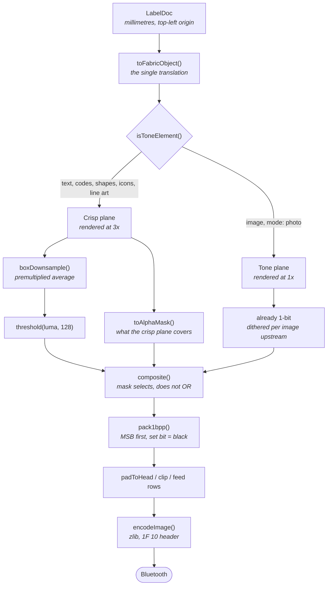

# From document to dots

How a `LabelDoc` becomes the 1-bit bitmap the print head receives, and which knobs
exist along the way.

The short version: everything is drawn twice, onto two separate planes that are
binarised by different rules and then merged. That is the one structural decision in
the renderer, and every other choice here follows from it.

## Why two planes

A thermal head prints one bit per dot. There is no grey, so every pixel has to be
decided one way or the other, and the right way to decide depends entirely on what
the pixel is part of.

- **Text, barcodes, QR, shapes, icons and line art** need a **hard threshold**. Their
  value is in their edges: a barcode module either has a clean boundary or it does
  not scan, and a glyph stem broken up by scattered dots reads as noise at 203 dpi.
- **Photographs** need **dithering**. Thresholded flat, a photo collapses to a few
  black blobs — not a worse photo, no photo at all.

Running one rule over both is not a compromise, it is two failures. So
`isToneElement()` (`src/model/labelDoc.ts`) routes each element to its own plane, and
the planes are merged afterwards.

### The crisp plane is supersampled; the tone plane is not

The crisp plane renders at **3×** and is box-averaged down before thresholding
(`CRISP_SUPERSAMPLE` in `src/render/rasterize.ts`).

Since ink is pure black, thresholding white-composited luminance at 128 is really
thresholding _coverage_ at 50% — so the result is only as good as the coverage
estimate. Rasterising a glyph at 3× and averaging gives a truer estimate than asking
the browser for it directly at 203 dpi, where font hinting distorts stems to fit a
pixel grid that has nothing to do with the print head. 3 rather than 2 or 4 because
it is odd, so a stem centred on a dot stays centred.

The tone plane gains nothing from this: error diffusion consumes the greyscale it is
handed, and a supersampled average is the same greyscale at nine times the cost.

### Merging is a mask, not an OR

`composite()` selects by the crisp plane's own alpha coverage rather than OR-ing the
two planes together. The difference matters exactly once, and it matters a lot: white
text laid over a photograph. OR-ing lets the photo's black dots win and the text
disappears. Masking lets crisp content own its pixels outright, white included.

## Dithering, and its parameters

Photographs are dithered **per image**, in `applyImageTone()`
(`src/render/toFabric.ts`), at the exact dot size the image will occupy — not once
over the shared tone plane. A single plane-wide pass cannot honour per-image
settings, and per-image settings are the whole point of the controls below.

This is safe because error diffusion over an already-binary input reproduces it with
zero error, so the plane-level pass in `rasterize.ts` becomes a no-op for anything
that came through `applyImageTone`. (`render.test.ts` pins that idempotency; if it
ever breaks, per-image dithering would silently get diffused a second time.) The
plane pass still earns its keep for the one case that reaches it as greyscale: a
**rotated** photo, which Fabric resamples into soft greys along its edges.

A useful side effect is that the editor canvas goes through the same function, so a
photo shows its real dithered output while you design rather than a greyscale
stand-in.

### The controls, per image, in the Inspector

| Control      | Range    | Default         | What it does                               |
| ------------ | -------- | --------------- | ------------------------------------------ |
| **Dither**   | below    | Floyd–Steinberg | Which algorithm binarises the tone         |
| **Strength** | 0–100%   | 100%            | Fraction of the quantisation error carried |
| **Bright**   | −100…100 | 0               | Added after contrast, before dithering     |
| **Contrast** | −100…100 | 0               | Multiplier about mid-grey                  |
| **Invert**   | —        | off             | Negative                                   |

Tone is applied **before** binarising, which is the only place it can go: afterwards
there are two levels left and nothing to adjust.

### Choosing an algorithm

**Floyd–Steinberg** is the default and the classic. It diffuses the full error into
four neighbours with a serpentine scan (alternating direction per row, which avoids
the diagonal "worm" artefacts plain left-to-right diffusion leaves on gradients).
Best tonal accuracy on a display. On paper it is the one that most often prints
muddy, because carrying all of the error drags highlights and shadows toward the
middle, and then the head's own dot gain closes the mid-greys up.

**Atkinson** diffuses only 6/8 of the error, discarding the rest. Deliberately lossy,
and that is the point: highlights stay white and shadows stay black instead of
converging. Usually the first thing to try when a photo prints as a grey smear.

**Ordered** (8×8 Bayer) carries no error at all — a dot depends only on its own
luminance and its position in the tile. The most robust of the three here, for a
reason specific to this hardware: error diffusion produces long trails of _isolated_
dots, and an isolated dot is exactly what a thermal head under- or over-prints least
predictably. The regular texture also survives the head's bleed, where a diffusion
pattern smears into itself.

**Strength** below 100% walks a diffusion kernel back towards a flat cut, which
occasionally suits a high-contrast photo where full diffusion sprays dots into what
should be clean white. For the ordered matrix it scales the pattern's amplitude
instead, so it means the same thing to a user either way.

### If a photo prints badly

Judge it in the **thermal simulation** preview, not the crisp one and not the editor
canvas — it models the head's bleed, and bleed is usually what went wrong. Then, in
order: switch to Atkinson or Ordered, lift the contrast, and only then reach for
density in the Print panel. Density affects the whole label, including text that was
already fine.

## Line art

`mode: lineart` skips all of the above and takes a hard threshold at the per-image
**Threshold** value, applied in the same `applyImageTone()` before the crisp plane
ever sees it. So by the time the plane is thresholded the pixels are already pure
black or white and the global setting cannot second-guess them. Raise the threshold
to catch faint lines.

New images default to **photo**, because the two mistakes are not symmetric: a
photograph thresholded flat is unrecognisable and does not look like a setting being
wrong, whereas line art dithered is merely a bit noisy and still plainly the right
picture.

## Geometry

203 dpi = 8 dots/mm exactly. Documents are authored in millimetres with a top-left
origin, matching how label stock is specified, and converted to dots once at render
time (`src/model/units.ts`).

The raster is sent at **label width, unpadded** — for a 40 mm label, 320 dots — which
is what a capture of the vendor app shows it doing. Padding out to the full 384-dot
head is available under Advanced in the Printer panel, but only for diagnosing
placement; see `docs/PROTOCOL.md`.
